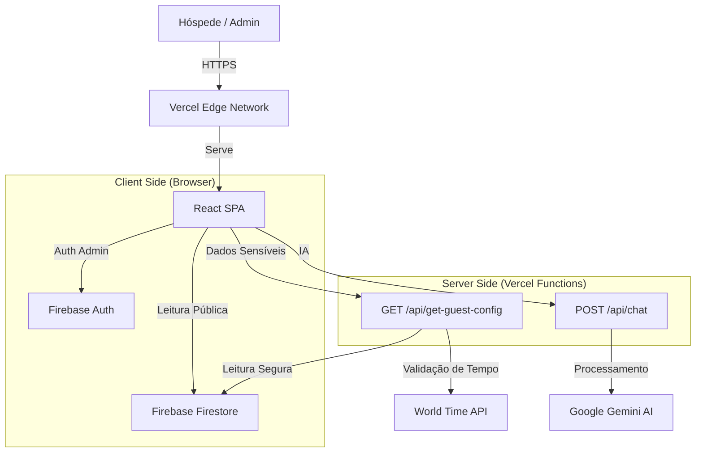

# 🏗️ Documentação de Arquitetura de Software - Flats Integração

**Versão:** 1.0.0
**Data:** 27/11/2025
**Status:** Produção

---

## 1. Visão Geral do Sistema

O **Flats Integração - Guia Digital** é uma Progressive Web App (PWA) projetada para atuar como um concierge digital autônomo. O sistema resolve o problema de distribuição segura de informações de acesso (senhas de porta/cofre) e fornece um guia local curado para hóspedes.

### 1.1 Diagrama de Arquitetura (Alto Nível)



---

## 2. Stack Tecnológico

| Camada | Tecnologia | Justificativa |
| :--- | :--- | :--- |
| **Frontend** | React 18 + TypeScript | Tipagem estática para robustez; Ecossistema rico. |
| **Build Tool** | Vite | Performance de desenvolvimento e build otimizado. |
| **Estilização** | Tailwind CSS | Desenvolvimento rápido e bundle CSS reduzido. |
| **Backend (BaaS)** | Firebase (Firestore + Auth) | Real-time database, auth gerenciada, custo-benefício. |
| **Serverless** | Vercel Functions (Node.js) | Execução de lógica segura (sanitização) sem gerenciar servidores. |
| **IA** | Google Gemini 1.5 Flash | Baixa latência e custo para respostas de chat. |

---

## 3. Modelo de Dados (Firestore NoSQL)

O banco de dados é orientado a documentos. Abaixo, as principais coleções:

### 3.1 `reservations` (Reservas)
Armazena os dados de cada estadia.
- `id` (string): Auto-gerado.
- `guestName` (string): Nome do hóspede.
- `checkInDate` (ISO Date): Data de entrada (YYYY-MM-DD).
- `checkoutDate` (ISO Date): Data de saída.
- `lockCode` (string): Senha da porta (SENSÍVEL).
- `status` (string): 'active' | 'cancelled'.

### 3.2 `app_config` (Configurações Globais)
Documentos únicos para configurações do sistema.
- **Doc `general`**:
    - `wifiSSID` (string): Nome da rede.
    - `wifiPass` (string): Senha do Wi-Fi (SENSÍVEL).
    - `safeCode` (string): Senha do cofre (SENSÍVEL).
    - `aiSystemPrompt` (string): Personalidade da IA.
- **Doc `hero_images`**:
    - `urls` (array): Lista de URLs para o carrossel.

### 3.3 `places` (Guia Local)
Recomendações de locais.
- `name` (string): Nome do estabelecimento.
- `category` (string): ID da categoria (ex: 'burgers', 'events').
- `imageUrl` (string): URL da foto.
- `visible` (boolean): Controle de exibição.
- `eventDate` (string, opcional): Para eventos temporários.

---

## 4. Arquitetura de Segurança

A segurança é o pilar central deste projeto, focada em prevenir o acesso prematuro a informações de entrada.

### 4.1 Modelo de Ameaça: "Time Spoofing"
Usuários mal-intencionados poderiam alterar o relógio do dispositivo para simular a data de check-in e obter senhas.

### 4.2 Solução: Server-Side Sanitization
1.  O Frontend **nunca** recebe o documento de reserva completo diretamente do Firestore.
2.  O Frontend chama `/api/get-guest-config?rid={ID}`.
3.  A Serverless Function:
    *   Busca a reserva no Firestore (usando `firebase-admin`).
    *   Obtém a hora oficial do servidor (Timezone: `America/Sao_Paulo`).
    *   Compara: `Hora Atual >= (Check-in - 24h)`.
    *   **Se VÁLIDO:** Retorna JSON com `lockCode` e `wifiPass`.
    *   **Se INVÁLIDO:** Retorna JSON com `lockCode: "****"` mascarado.

### 4.3 Proteção de Rotas
-   `/admin`: Protegida via verificação de estado do Firebase Auth (`onAuthStateChanged`). Redireciona para login se não autenticado.

---

## 5. Estratégia de Qualidade e Testes

### 5.1 Testes Unitários (Vitest)
Focados na lógica de negócios crítica e isolada.
-   **Hooks:** `useGuestStay` (cálculo de datas), `useGuestData`.
-   **Utils:** `iconMap`, formatadores.
-   **Mocking:** Uso de `vi.useFakeTimers` para simular diferentes datas e horários de check-in/out.

### 5.2 Validação de Dados (Zod)
Camada de defesa na entrada da API Serverless.
-   Garante que `rid` seja uma string válida.
-   Valida formatos de data e inputs do chat.
-   Retorna erros estruturados para o frontend.

---

## 5. API Reference (Serverless)

### `GET /api/get-guest-config`
Retorna a configuração da estadia sanitizada.
-   **Query Params:** `rid` (Reservation ID).
-   **Response (200):**
    ```json
    {
      "guestName": "João",
      "checkInDate": "2025-12-01",
      "lockCode": "****", // Mascarado se antes do check-in
      "wifiPass": "Disponível no Check-in"
    }
    ```

### `POST /api/chat`
Endpoint para interação com a IA.
-   **Body:** `{ message: string, history: [], guestName: string }`
-   **Response (200):** `{ text: "Resposta da IA..." }`

---

## 6. Guia de Operação e Manutenção

### 6.1 Adicionando Conteúdo
O painel CMS (`/admin`) é a interface exclusiva para gestão. Não edite dados diretamente no console do Firebase para evitar inconsistências de tipo.

### 6.2 Monitoramento
-   **Logs de Erro:** Disponíveis no Dashboard da Vercel (aba Functions).
-   **Analytics:** Google Analytics (pode ser integrado via `index.html`).

### 6.3 Backup
O Firestore possui backups automáticos (se configurado no plano Blaze). Recomenda-se exportar dados críticos mensalmente via Google Cloud Console.

---

## 7. Procedimentos de Deploy

O projeto utiliza CI/CD via Vercel Git Integration.
1.  **Commit & Push** para a branch `main`.
2.  A Vercel detecta a mudança, inicia o build (`npm run build`).
3.  Se o build for bem-sucedido, a nova versão é promovida para produção automaticamente.

---
**Documentação Técnica Elaborada por:** Antigravity AI
