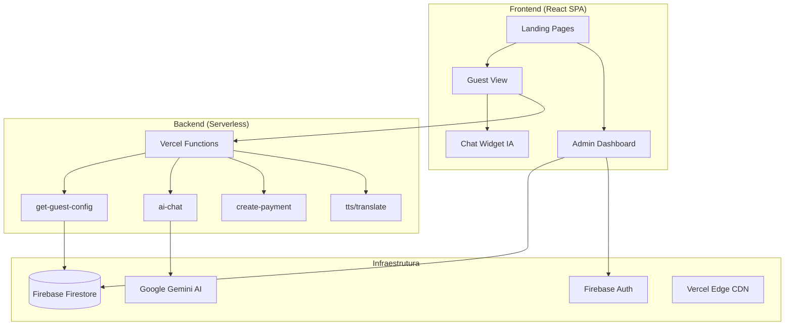

# 📚 Documentação Completa - Flats Integração

**Data da Auditoria:** 01/01/2026  
**Versão:** 2.0.0  
**Status:** Produção

---

## 📋 Índice

1. [Visão Geral do Sistema](#1-visão-geral-do-sistema)
2. [Arquitetura Técnica](#2-arquitetura-técnica)
3. [Stack Tecnológico](#3-stack-tecnológico)
4. [Estrutura de Diretórios](#4-estrutura-de-diretórios)
5. [Componentes Principais](#5-componentes-principais)
6. [Hooks Personalizados](#6-hooks-personalizados)
7. [Serviços e Integrações](#7-serviços-e-integrações)
8. [APIs Serverless](#8-apis-serverless)
9. [Modelo de Dados](#9-modelo-de-dados)
10. [Sistema de Segurança](#10-sistema-de-segurança)
11. [Sistema de Design](#11-sistema-de-design)
12. [Testes e Qualidade](#12-testes-e-qualidade)
13. [Deploy e CI/CD](#13-deploy-e-cicd)
14. [Guia de Manutenção](#14-guia-de-manutenção)

---

## 1. Visão Geral do Sistema

O **Flats Integração - Guia Digital** é uma Progressive Web Application (PWA) multi-tenant projetada para atuar como um concierge digital autônomo para hóspedes de imóveis de aluguel por temporada.

### 1.1 Problema Resolvido

- **Distribuição segura de credenciais**: Senhas de porta/cofre/Wi-Fi só são liberadas no dia do check-in
- **Guia local curado**: Recomendações de restaurantes, passeios e eventos
- **Suporte 24/7**: Chatbot com IA (Google Gemini) para dúvidas
- **Gestão centralizada**: Painel administrativo completo para gestão multi-propriedade

### 1.2 Públicos Alvo

| Público               | Funcionalidades                                             |
| --------------------- | ----------------------------------------------------------- |
| **Hóspedes**          | Acesso a informações da estadia, guia local, suporte via IA |
| **Administradores**   | Gestão de reservas, conteúdo, configurações, relatórios     |
| **Property Managers** | Acesso restrito a propriedades específicas                  |

### 1.3 Propriedades Suportadas

- **Lili** (`lili`): Flat individual com landing page dedicada
- **Integração** (`integracao`): Edificação com múltiplos flats

---

## 2. Arquitetura Técnica

### 2.1 Diagrama de Alto Nível



### 2.2 Fluxo de Dados

1. **Acesso do Hóspede**: Recebe link único com `?rid={ID}` → Frontend chama API `/api/get-guest-config`
2. **Validação Server-Side**: API verifica data no servidor → Libera ou mascara credenciais
3. **Admin Auth**: Login Firebase → Carregamento de permissões → Acesso ao dashboard

---

## 3. Stack Tecnológico

### 3.1 Frontend

| Tecnologia        | Versão   | Propósito                        |
| ----------------- | -------- | -------------------------------- |
| **React**         | 19.2.1   | Framework UI                     |
| **TypeScript**    | 5.2.2    | Tipagem estática                 |
| **Vite**          | 7.2.4    | Build tool & dev server          |
| **Tailwind CSS**  | 3.4.16   | Estilização utility-first        |
| **GSAP**          | 3.14.2   | Animações avançadas              |
| **Framer Motion** | 12.23.25 | Animações React                  |
| **React Query**   | 5.90.12  | Gerenciamento de estado servidor |
| **React Router**  | 7.11.0   | Roteamento SPA                   |
| **Lucide React**  | 0.556.0  | Ícones SVG                       |

### 3.2 Backend & Infraestrutura

| Tecnologia                  | Propósito                          |
| --------------------------- | ---------------------------------- |
| **Firebase Firestore**      | Banco de dados NoSQL em tempo real |
| **Firebase Auth**           | Autenticação de administradores    |
| **Vercel Functions**        | Lógica server-side (Node.js)       |
| **Google Gemini 1.5 Flash** | IA para chatbot e sugestões        |
| **Mercado Pago**            | Processamento de pagamentos        |

### 3.3 Qualidade & DevOps

| Tecnologia                | Propósito                   |
| ------------------------- | --------------------------- |
| **Vitest**                | Testes unitários            |
| **React Testing Library** | Testes de componentes       |
| **Playwright**            | Testes E2E                  |
| **Storybook**             | Documentação de componentes |
| **ESLint + Prettier**     | Linting e formatação        |
| **Husky + lint-staged**   | Git hooks                   |

---

## 4. Estrutura de Diretórios

```
📁 copy-of-react-project-workspace01/
├── 📁 api/                      # Vercel Serverless Functions
│   ├── get-guest-config.ts      # Endpoint principal (sanitização de dados)
│   ├── ai-chat.ts               # Chat com Gemini
│   ├── create-payment.ts        # Integração Mercado Pago
│   ├── translate.ts             # Tradução automática
│   └── tts.ts                   # Text-to-Speech
│
├── 📁 src/
│   ├── 📁 components/           # 137 componentes React
│   │   ├── 📁 admin/            # Dashboard administrativo (38 arquivos)
│   │   ├── 📁 guest/            # Componentes para hóspedes
│   │   ├── 📁 LandingFlats/     # Landing page Flats Integração
│   │   ├── 📁 LandingLili/      # Landing page Flat Lili
│   │   ├── 📁 ui/               # Componentes UI primitivos
│   │   ├── 📁 modals/           # Modais reutilizáveis
│   │   └── ...                  # Componentes compartilhados
│   │
│   ├── 📁 hooks/                # 39 hooks personalizados
│   ├── 📁 services/             # Integrações externas
│   │   └── 📁 firebase/         # 18 módulos Firebase
│   ├── 📁 contexts/             # 4 contextos React
│   ├── 📁 pages/                # Páginas da aplicação
│   ├── 📁 utils/                # Utilitários (15 arquivos)
│   ├── 📁 config/               # Configurações
│   ├── types.ts                 # Tipos TypeScript centralizados
│   ├── constants.tsx            # Constantes da aplicação
│   ├── App.tsx                  # Componente raiz
│   └── index.tsx                # Entry point
│
├── 📁 android/                  # Build Capacitor Android
├── 📁 public/                   # Assets estáticos
├── index.html                   # Entry point HTML principal
├── lili.html                    # Entry point landing Lili
├── firestore.rules              # Regras de segurança Firestore
└── package.json                 # Dependências e scripts
```

---

## 5. Componentes Principais

### 5.1 Módulo Admin (`/src/components/admin/`)

| Componente               | Linhas | Propósito                      |
| ------------------------ | ------ | ------------------------------ |
| `ReservationForm.tsx`    | ~1500  | Formulário completo de reserva |
| `ReservationList.tsx`    | ~1500  | Listagem com filtros e ações   |
| `DashboardHome.tsx`      | ~600   | Visão geral e métricas         |
| `AdminDashboard.tsx`     | ~600   | Container principal do admin   |
| `AdminNavigation.tsx`    | ~500   | Navegação lateral responsiva   |
| `TipsManager.tsx`        | ~550   | Gerenciador de dicas do flat   |
| `SettingsManager.tsx`    | ~400   | Configurações globais          |
| `InspectionReport.tsx`   | ~400   | Relatório de vistoria          |
| `ImageUpload.tsx`        | ~350   | Upload de imagens              |
| `AnalyticsDashboard.tsx` | ~300   | Analytics e métricas           |

### 5.2 Módulo Guest (`/src/components/guest/`)

| Componente                 | Propósito                                  |
| -------------------------- | ------------------------------------------ |
| `HeroSection.tsx`          | Seção hero com slideshow                   |
| `GuestHeader.tsx`          | Cabeçalho com info do hóspede              |
| `GuestStatusCard.tsx`      | Card de status da estadia                  |
| `StoriesBar.tsx`           | Carrossel de curiosidades estilo Instagram |
| `GuestRecommendations.tsx` | Recomendações de locais                    |

### 5.3 Landing Pages

#### LandingFlats (Integração)

- `Hero.tsx` - Hero section com animações GSAP
- `FeaturesSection.tsx` - Diferenciais do imóvel
- `GallerySection.tsx` - Galeria de fotos
- `ReputationSection.tsx` - Avaliações e reputação
- `FAQSection.tsx` - Perguntas frequentes
- `BlogSection.tsx` - Artigos do blog local
- `LocationSection.tsx` - Mapa e localização
- `GuestAccessSection.tsx` - CTA para reserva

#### LandingLili (Flat Lili)

- Layout similar com design personalizado para a propriedade

### 5.4 Componentes UI (`/src/components/ui/`)

| Componente           | Propósito            |
| -------------------- | -------------------- |
| `Button.tsx`         | Botões estilizados   |
| `Card.tsx`           | Cards com variantes  |
| `Input.tsx`          | Inputs de formulário |
| `Badge.tsx`          | Badges de status     |
| `BottomSheet.tsx`    | Bottom sheet mobile  |
| `Toast.tsx`          | Notificações toast   |
| `OptimizedImage.tsx` | Imagens otimizadas   |
| `ScrollReveal.tsx`   | Animações de scroll  |
| `MetricCard.tsx`     | Cards de métricas    |
| `WifiQRCode.tsx`     | QR Code para Wi-Fi   |

### 5.5 Componentes Compartilhados

| Componente            | Linhas | Propósito                  |
| --------------------- | ------ | -------------------------- |
| `GuestView.tsx`       | ~800   | Visão completa do hóspede  |
| `PlaceCard.tsx`       | ~850   | Card de local/recomendação |
| `ChatWidget.tsx`      | ~550   | Widget de chat com IA      |
| `LiveVoiceWidget.tsx` | ~500   | Widget de voz (TTS)        |
| `SmartSuggestion.tsx` | ~450   | Sugestões contextuais      |
| `StoryViewer.tsx`     | ~450   | Visualizador de stories    |
| `ErrorBoundary.tsx`   | ~270   | Tratamento de erros React  |

---

## 6. Hooks Personalizados

### 6.1 Hooks de Autenticação e Admin

| Hook                   | Propósito                             |
| ---------------------- | ------------------------------------- |
| `useAdminAuth.ts`      | Gerencia estado de autenticação admin |
| `useManualAuth.ts`     | Auth com email/senha                  |
| `useAdminDashboard.ts` | Estado global do dashboard            |
| `useAdminContent.ts`   | CRUD de conteúdo (places, tips)       |
| `useAdminSettings.ts`  | Configurações do app                  |

### 6.2 Hooks de Hóspede

| Hook                 | Propósito                                     |
| -------------------- | --------------------------------------------- |
| `useGuestData.ts`    | Busca dados da reserva via API                |
| `useGuestStay.ts`    | Cálculos de datas (dias restantes, progresso) |
| `useGuestTheme.ts`   | Tema dinâmico baseado em hora                 |
| `useGuestUI.ts`      | Estado da UI do guest view                    |
| `useGuestReviews.ts` | Avaliações do hóspede                         |

### 6.3 Hooks de Reserva

| Hook                    | Propósito                       |
| ----------------------- | ------------------------------- |
| `useReservations.ts`    | CRUD de reservas                |
| `useReservationForm.ts` | Estado do formulário de reserva |
| `useBlockedDates.ts`    | Datas bloqueadas no calendário  |

### 6.4 Hooks de UI/UX

| Hook                      | Propósito              |
| ------------------------- | ---------------------- |
| `usePullToRefresh.ts`     | Pull-to-refresh mobile |
| `useSwipeToDismiss.ts`    | Swipe para dispensar   |
| `useLongPress.ts`         | Detecção de long press |
| `useSpeechRecognition.ts` | Reconhecimento de voz  |
| `useTextToSpeech.ts`      | Síntese de voz         |

### 6.5 Hooks de Infraestrutura

| Hook                      | Propósito                     |
| ------------------------- | ----------------------------- |
| `useAppInitialization.ts` | Inicialização do app          |
| `useLanguage.ts`          | Internacionalização           |
| `usePushNotifications.ts` | Notificações push (Capacitor) |

---

## 7. Serviços e Integrações

### 7.1 Firebase Services (`/src/services/firebase/`)

| Serviço           | Propósito                            |
| ----------------- | ------------------------------------ |
| `config.ts`       | Configuração do Firebase Client      |
| `auth.ts`         | Autenticação                         |
| `reservations.ts` | CRUD de reservas                     |
| `places.ts`       | CRUD de locais                       |
| `content.ts`      | CRUD de conteúdo (tips, curiosities) |
| `appSettings.ts`  | Configurações globais                |
| `blockedDates.ts` | Datas bloqueadas                     |
| `logs.ts`         | Logs de atividade                    |
| `storage.ts`      | Upload de arquivos                   |
| `mappers.ts`      | Mapeadores de dados                  |

### 7.2 Outros Serviços

| Serviço             | Propósito                       |
| ------------------- | ------------------------------- |
| `geminiService.ts`  | Integração com Google Gemini AI |
| `analytics.ts`      | Google Analytics 4              |
| `cloudinary.ts`     | Upload e otimização de imagens  |
| `translation.ts`    | Tradução via API                |
| `guest.ts`          | Funções específicas de hóspede  |
| `userManagement.ts` | Gestão de usuários admin        |

---

## 8. APIs Serverless

### 8.1 GET `/api/get-guest-config`

**Propósito**: Retorna configuração da estadia com sanitização server-side.

**Parâmetros**:

- `rid` (string): ID da reserva ou short ID

**Validação**:

- Zod schema para input
- Rate limiting (30 req/min por IP)
- CORS configurado

**Lógica de Liberação**:

```
Se (data_atual >= check_in - 1 dia):
    Retorna credenciais reais
Senão:
    Retorna credenciais mascaradas ("****")
```

**Response**:

```json
{
    "guestName": "João Silva",
    "checkInDate": "2026-01-15",
    "checkoutDate": "2026-01-20",
    "lockCode": "1234", // ou "****" se não liberado
    "wifiSSID": "Flat_5G",
    "wifiPass": "senha123", // ou "Disponível no Check-in"
    "isReleased": true,
    "propertyId": "lili"
}
```

### 8.2 POST `/api/ai-chat`

**Propósito**: Chat com IA usando Google Gemini.

**Body**:

```json
{
  "message": "Qual o melhor restaurante?",
  "history": [...],
  "guestName": "João",
  "propertyId": "lili"
}
```

### 8.3 POST `/api/create-payment`

**Propósito**: Cria preferência de pagamento Mercado Pago.

### 8.4 POST `/api/translate`

**Propósito**: Traduz texto para idioma especificado.

### 8.5 POST `/api/tts`

**Propósito**: Converte texto em áudio (Text-to-Speech).

---

## 9. Modelo de Dados

### 9.1 Coleção `reservations`

```typescript
interface Reservation {
    id?: string;
    shortId?: string; // Código curto (ex: "LILI01")
    guestName: string;
    guestPhone?: string;
    email?: string;
    propertyId: 'lili' | 'integracao';
    flatNumber?: string; // Apenas para Integração
    checkInDate: string; // YYYY-MM-DD
    checkoutDate: string;
    checkInTime?: string; // HH:MM
    checkOutTime?: string;
    lockCode?: string;
    welcomeMessage?: string;
    adminNotes?: string;
    guestAlertActive?: boolean;
    guestAlertText?: string;
    guestCount?: number;
    paymentMethod?: 'pix' | 'money' | 'card';
    guestRating?: number; // 1-5
    guestFeedback?: string;
    manualDeactivation?: boolean;
    status: 'active' | 'cancelled' | 'pending';
    createdAt: string;
}
```

### 9.2 Coleção `app_config`

**Documento `general`**:

```typescript
interface AppConfig {
    wifiSSID: string;
    wifiPass: string; // SENSÍVEL
    safeCode: string; // SENSÍVEL
    noticeActive: boolean;
    noticeText: string;
    globalNotices?: Record<string, { active: boolean; text: string }>;
    hostPhones?: Record<string, string>;
    aiSystemPrompt?: string;
    aiSystemPrompts?: Record<string, string>;
    cityCuriosities?: CityCuriosity[];
    checklist?: ChecklistItem[];
    messageTemplates?: MessageTemplates;
}
```

### 9.3 Coleção `places`

```typescript
interface PlaceRecommendation {
    id?: string;
    category: PlaceCategory;
    name: string;
    description: string;
    address?: string;
    tags: string[];
    imageUrl: string;
    mapsLink?: string;
    distance?: string;
    phoneNumber?: string;
    whatsapp?: string;
    orderLink?: string;
    visible: boolean;
    // I18n Fields
    name_en?: string;
    description_en?: string;
    name_es?: string;
    description_es?: string;
    // Event Fields
    eventDate?: string;
    eventEndDate?: string;
}
```

### 9.4 Coleção `tips`

```typescript
interface Tip {
    id?: string;
    type: 'curiosity' | 'event';
    title: string;
    subtitle: string;
    content: string;
    iconName: string;
    image?: string;
    order?: number;
    visible?: boolean;
    // I18n Fields
    title_en?: string;
    content_en?: string;
    title_es?: string;
    content_es?: string;
}
```

### 9.5 Coleção `admin_users`

```typescript
interface UserPermission {
    email: string;
    role: 'super_admin' | 'property_manager';
    allowedProperties: PropertyId[];
}
```

### 9.6 Coleção `blocked_dates`

```typescript
interface BlockedDateRange {
    id?: string;
    startDate: string; // YYYY-MM-DD
    endDate: string;
    reason?: string;
}
```

---

## 10. Sistema de Segurança

### 10.1 Modelo de Ameaça: Time Spoofing

**Problema**: Usuários mal-intencionados alteram relógio do dispositivo para obter senhas antes do check-in.

**Solução**: **Server-Side Sanitization**

1. Frontend nunca recebe documento de reserva completo
2. API valida data usando hora do servidor
3. Credenciais mascaradas até data de liberação

### 10.2 Firestore Rules

```javascript
// Principais regras implementadas:

// Super Admin tem acesso total
function isSuperAdmin() {
    return getAdminUser().role == 'super_admin';
}

// Property Manager tem acesso apenas às suas propriedades
function hasPropertyAccess(propertyId) {
    return user.role == 'super_admin' || user.allowedProperties.hasAny([propertyId]);
}

// Validação anti-spam em reservas
function isValidReservation() {
    return (
        data.guestName.size() >= 2 &&
        data.guestPhone.size() >= 8 &&
        data.checkInDate.matches('^[0-9]{4}-[0-9]{2}-[0-9]{2}$')
    );
}
```

### 10.3 Rate Limiting

- APIs protegidas: 30 req/min por IP
- Mapa em memória com reset automático
- Fallback permissivo em caso de erro

### 10.4 CORS

```javascript
const ALLOWED_ORIGINS = [
    'https://guia-digital-flatlili.vercel.app',
    'https://www.flatsintegracao.com.br',
    'http://localhost:5173',
];

const ALLOWED_PATTERNS = [/^https:\/\/guia-digital-flatlili-.*\.vercel\.app$/];
```

### 10.5 Validação de Inputs

- **Zod** para validação tipada em todas as APIs
- Schemas definidos para cada endpoint
- Erros estruturados retornados ao frontend

---

## 11. Sistema de Design

### 11.1 Design Tokens (Tailwind)

**Cores:**

```javascript
colors: {
  gray: {
    900: '#111827', 800: '#1f2937', 700: '#374151',
    600: '#4b5563', 500: '#6b7280', 100: '#f3f4f6', 50: '#f9fafb'
  },
  orange: {
    50: '#fff7ed', 100: '#ffedd5',
    500: '#f97316', 600: '#ea580c'
  }
}
```

**Tipografia:**

```javascript
fontFamily: {
  sans: ['Inter', 'sans-serif'],
  heading: ['Outfit', 'Montserrat', 'sans-serif']
}
```

### 11.2 Classes CSS Utilitárias

```css
/* Cards */
.ui-card          /* Card sólido */
.ui-card-glass    /* Card com glassmorphism */

/* Botões */
.ui-btn           /* Botão base */
.ui-btn-primary   /* Botão primário (laranja) */
.ui-btn-secondary /* Botão secundário */
.ui-btn-danger    /* Botão de perigo (vermelho) */

/* Inputs */
.ui-input         /* Input base */
.ui-input-search  /* Input de busca */

/* Badges */
.ui-badge         /* Badge base */
.ui-badge-orange  /* Badge laranja */
.ui-badge-green   /* Badge verde */

/* Modal */
.ui-modal-backdrop
.ui-modal-content
```

### 11.3 Animações

```css
/* Tailwind animations */
animate-fadeIn
animate-scaleIn
animate-pulse-slow
animate-shimmer

/* Custom animations */
animate-sunrise-sun
animate-sunrise-text
animate-logo-shimmer
animate-jump
animate-shake
```

### 11.4 Glassmorphism

```css
.glass {
    background: rgba(255, 255, 255, 0.1);
    backdrop-filter: blur(10px);
    border: 1px solid rgba(255, 255, 255, 0.18);
}

.glass-dark {
    background: rgba(17, 24, 39, 0.8);
    backdrop-filter: blur(12px);
}
```

### 11.5 Safe Areas (Mobile)

```css
:root {
    --safe-area-top: env(safe-area-inset-top, 0px);
    --safe-area-bottom: env(safe-area-inset-bottom, 0px);
}

.safe-x {
    padding-left/right: max(1rem, var(--safe-area- *));
}
.safe-y {
    padding-top/bottom: max(1rem, var(--safe-area- *));
}
```

---

## 12. Testes e Qualidade

### 12.1 Estrutura de Testes

```
📁 src/
├── test/
│   ├── setup.ts              # Setup global do Vitest
│   └── mocks/                # Mocks compartilhados
├── hooks/
│   ├── useGuestStay.test.ts
│   ├── useAdminAuth.test.ts
│   └── ...
├── services/
│   ├── firebase/
│   │   ├── reservations.test.ts
│   │   └── ...
│   └── geminiService.test.ts
└── utils/
    ├── analytics.test.ts
    └── ...
```

### 12.2 Cobertura de Testes

| Módulo            | Arquivos de Teste      |
| ----------------- | ---------------------- |
| Hooks             | 19 arquivos `.test.ts` |
| Services Firebase | 8 arquivos `.test.ts`  |
| Utils             | 7 arquivos `.test.ts`  |
| Components        | Storybook + Vitest     |

### 12.3 Scripts de Teste

```bash
npm test           # Roda todos os testes (Vitest)
npm run storybook  # Inicia Storybook (porta 6006)
```

### 12.4 Linting

```bash
npm run lint       # ESLint
npm run format     # Prettier
```

### 12.5 Husky (Git Hooks)

- **pre-commit**: `lint-staged` (ESLint + Prettier)
- Arquivos `.ts/.tsx`: Lint + Format
- Arquivos `.json/.css/.md`: Format only

---

## 13. Deploy e CI/CD

### 13.1 Vercel Integration

1. **Push para `main`** → Build automático
2. **Preview Deployments** → Para cada PR
3. **Environment Variables** → Configuradas no painel Vercel

### 13.2 Build Pipeline

```bash
npm run build
# Executa: tsc && vite build && node src/scripts/generate-sitemap.js
```

### 13.3 Múltiplos Entry Points

```javascript
// vite.config.ts
build: {
  rollupOptions: {
    input: {
      main: 'index.html',
      lili: 'lili.html'
    }
  }
}
```

### 13.4 Capacitor (Android)

```bash
npx cap sync      # Sincroniza com projeto Android
npx cap open android # Abre no Android Studio
```

---

## 14. Guia de Manutenção

### 14.1 Adicionar Nova Propriedade

1. Atualizar tipo `PropertyId` em `types.ts`
2. Adicionar configurações em `constants.tsx`
3. Criar landing page em `src/components/Landing{Nome}/`
4. Adicionar HTML entry point se necessário
5. Atualizar Firestore rules

### 14.2 Adicionar Nova Categoria de Lugar

1. Adicionar em `PlaceCategory` (`types.ts`)
2. Adicionar ícone em `iconMap.ts`
3. Atualizar componentes de filtro no admin

### 14.3 Atualizar Prompts da IA

1. Via Admin Dashboard → Configurações → Prompt IA
2. Ou diretamente em `app_config.general.aiSystemPrompt`

### 14.4 Monitoramento

- **Logs de Erro**: Vercel Dashboard → Functions
- **Analytics**: Google Analytics 4
- **Firestore**: Console Firebase

### 14.5 Backup

- Firestore: Backups automáticos (Plano Blaze)
- Exportação manual: Google Cloud Console
- Recomendação: Exportar mensalmente

---

## 15. Variáveis de Ambiente

### 15.1 Frontend (VITE\_\*)

```env
VITE_FIREBASE_API_KEY=...
VITE_FIREBASE_AUTH_DOMAIN=...
VITE_FIREBASE_PROJECT_ID=...
VITE_FIREBASE_STORAGE_BUCKET=...
VITE_FIREBASE_MESSAGING_SENDER_ID=...
VITE_FIREBASE_APP_ID=...
```

### 15.2 Backend (Vercel Functions)

```env
# Firebase Admin
FIREBASE_PROJECT_ID=...
FIREBASE_CLIENT_EMAIL=...
FIREBASE_PRIVATE_KEY="..."

# Google Gemini
GEMINI_API_KEY=...

# Mercado Pago
MERCADO_PAGO_ACCESS_TOKEN=...
```

---

## 📊 Estatísticas do Projeto

| Métrica                  | Valor                |
| ------------------------ | -------------------- |
| **Total de Arquivos**    | ~250 arquivos        |
| **Componentes React**    | 137 componentes      |
| **Hooks Personalizados** | 39 hooks             |
| **Serviços**             | 29 serviços          |
| **APIs Serverless**      | 10 endpoints         |
| **Arquivos de Teste**    | ~35 arquivos         |
| **Dependências**         | 30 deps + 38 devDeps |

---

**Documentação gerada por:** Antigravity AI  
**Última atualização:** 01/01/2026
